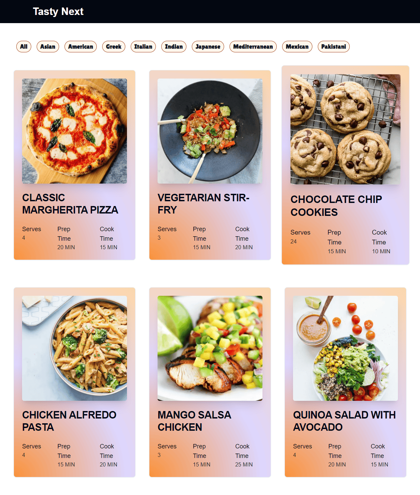

# Next Recipe Project

From tutorial by Ankita Kulkarni https://www.youtube.com/watch?v=JB1aKAoj2o0

# Resulting Page
- Responsive recipe cards using Tailwind
- Cached slug addresses using StatisParams
- `Image` components provided by Next
- Context for the filter state

# Instructions

- `npm run dev`
- `npm run build`
- `npm run start`
- [http://localhost:3000](http://localhost:3000)
